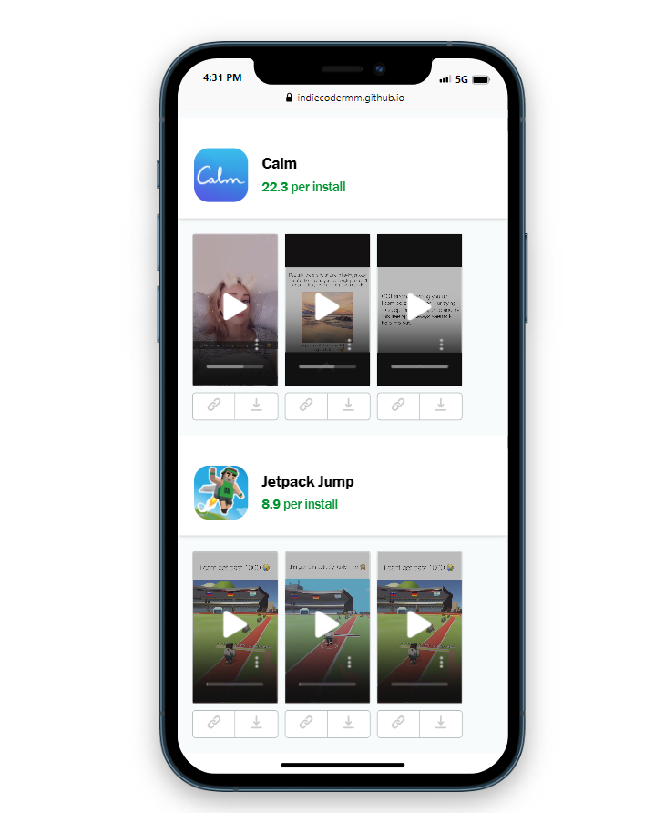

# Plug Feed - React Challenge

> A frontend exercise from [react-take-home](https://github.com/reallabs/react-take-home)

This project aims to recreate the main offer feed of [**The Plug**](https://www.plugco.in/), which is used by influencers to access offers, track earnings and manage their accounts.

## Challenge

**Time Frame: 4 Hr**

The main goal was to render data from the sample API according to the provided Figma design.

- Communicate with API and receive JSON data ✔
- Render the data according to the provided Figma design ✔
- Create a seamless user experience similar to **The Plug** app ✔
- Handle failed API requests ✔
- Create UI for failed state ⏳
- Implement inline video playback ✔
- Optimize load time ⏳
- Optimize scroll performance ⏳

*Some features marked with ⏳ couldn't be implemented within time limitation, but I plan to add them soon*

## Stack

This project is built with React. The main technologies used are:
- Create React App: To set up the project
- Fetch API: To get JSON data from API endpoint
- Prop Types: Library for validating props during development
- React Icons: Rich and simple icon library

## Screenshot



## Live Demo

You can visit the [deployed website here](https://indiecodermm.github.io/PlugFeed-React/).

## Installation

To run this project locally, follow the steps below.

1. Clone the repository to your local machine:

```bash
git clone git@github.com:IndieCoderMM/PlugFeed-React.git
```

2. Navigate to the project directory:

```bash
cd PlugFeed-React
```

3. Install the required dependencies:

```bash
npm install
```

4. Start the development server:

```bash
npm start
```

5. Open your web browser and visit http://localhost:3000 to view the JetFuel Plug Feed app.

## License
This project is licensed under the MIT License.

## Contact
For any questions or feedback, feel free to reach out to me at hthant00chk@gmail.com.

## Acknowledgments

Special thanks to the JetFuel team for providing this frontend exercise.